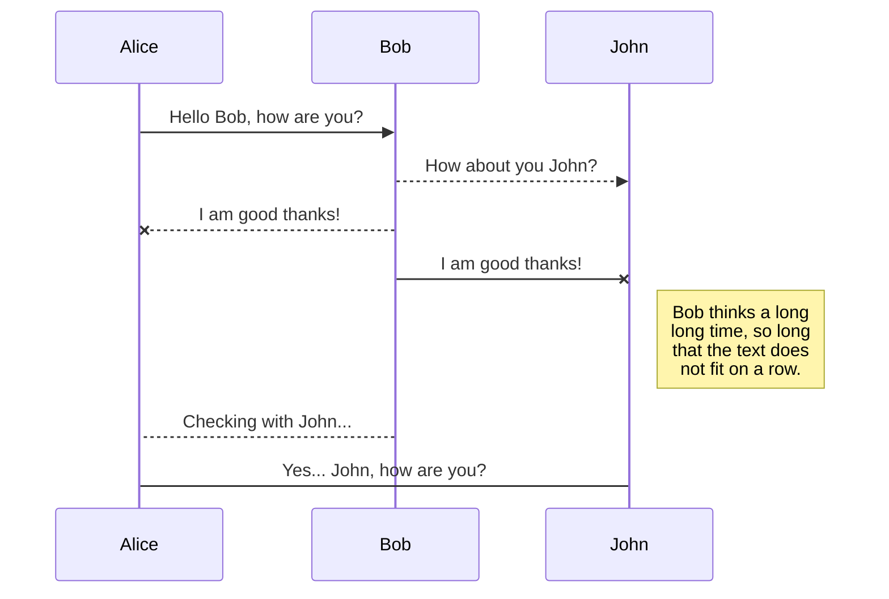

# Header
Your content here

```csharp
    public ActionResult EmployeeList(string query = "", int id = 0)
    {
        if (String.IsNullOrEmpty(query) || query.Length < 2)
        {
            return Json(new List<XEditableItem> { }, JsonRequestBehavior.AllowGet);
        }
        query = query.ToLower();
        var employee = Db.Employee
                .Where(emp => !emp.Disabled)
                .Where(x => (x.Lastname + " " + x.Firstname).ToLower().Contains(query) 
                || x.Email.ToLower().Contains(query) || x.Trigram.ToLower().Contains(query))
                .OrderBy(emp => emp.Lastname + emp.Firstname)
                .Take(10)
                .ToList()
                .Select(x => new XEditableItem { id = x.EmployeeId, text = x.FullName });
        return Json(employee, JsonRequestBehavior.AllowGet);
    }
```

`var example = "hello!";`



```plantuml
Bob->Alice : hello
```

# Tabs {.tabset}
## First Tab

Any content here will go into the first tab...

## Second Tab

Any content here will go into the second tab...

## Third Tab

Any content here will go into the third tab...


```xml
<Project Sdk="Microsoft.NET.Sdk">

  <PropertyGroup>
    <TargetFramework>netstandard2.0</TargetFramework>
  </PropertyGroup>

</Project>
```

# Big header
## Medium header
### Small header
#### Tiny header

| Column 1 | Column 2 | Column 3 |
| -------- | -------- | -------- |
| John     | Doe      | Male     |
| Mary     | Smith    | Female   |
Or without aligning the columns...
| Column 1 | Column 2 | Column 3 |
| -------- | -------- | -------- |
| John | Doe | Male |
| Mary | Smith | Female |


# <span style='color:#e67e22;'> Why this architecture?</span>
This architecture is closely inspired from the [Microsoft architecture guidelines](https://docs.microsoft.com/en-us/xamarin/cross-platform/app-fundamentals/building-cross-platform-applications/) and enables to:
* Maximize code sharing
* Split the responsabilty across the application to improve maintainabiltiy and reusability
* Keep logic localized
* Simplify unit <span style='color:#000000;'><span style='color:#37e114;'>tests</span></span>
# <span style='color:#e67e22;'> Description </span>
## <span style='color:#424241;'> Structure </span>

This architecture is divided into 7 main layers, each of them being in charge of a specifc scope of the application. 

Every layer can only reference itself or the layer(s) just **directly** (not more than one level) below it.

Next to these, there is one last layer, the *Cross* layer, which does not follow the previous constraints and is accessible by any other layer. Normally you do not need it in your application but be aware that it exists.


Development wise, each layer is implemented in a different project.


## <span style='color:#424241;'> Layers </span>

### User Interface Layer

It contains all the elements related to the graphical user interfaces of the application like the definition of its screens.

### Application Layer

It contains all the application logic, you will find in there the access to native APIs, resources files, definition of the models to display...

### Business Logic Layer

It contains the data logic, provides the data to the rest of the application and manages the different data sources.

### Service Access Layer

It is used to access to remote sources (like web APIs) to retireve and send data.

### Service Layer

It contains the API communication engine.

### Data Access Layer

It contains the models and managers to manipulate data from the local database. This means that it contains the query to retrieve the data for example.

### Data Layer

It contains the local database communication engine.

# <span style='color:#e67e22;'> Design patterns </span>
The **Layered Architecture** is not opposed to design patterns.

In the contrary, the main mobile design patterns, **MVC**, **MVP** and **MVVM**, can be refleted in this architecture as illustrated bellow.


---

---

---
